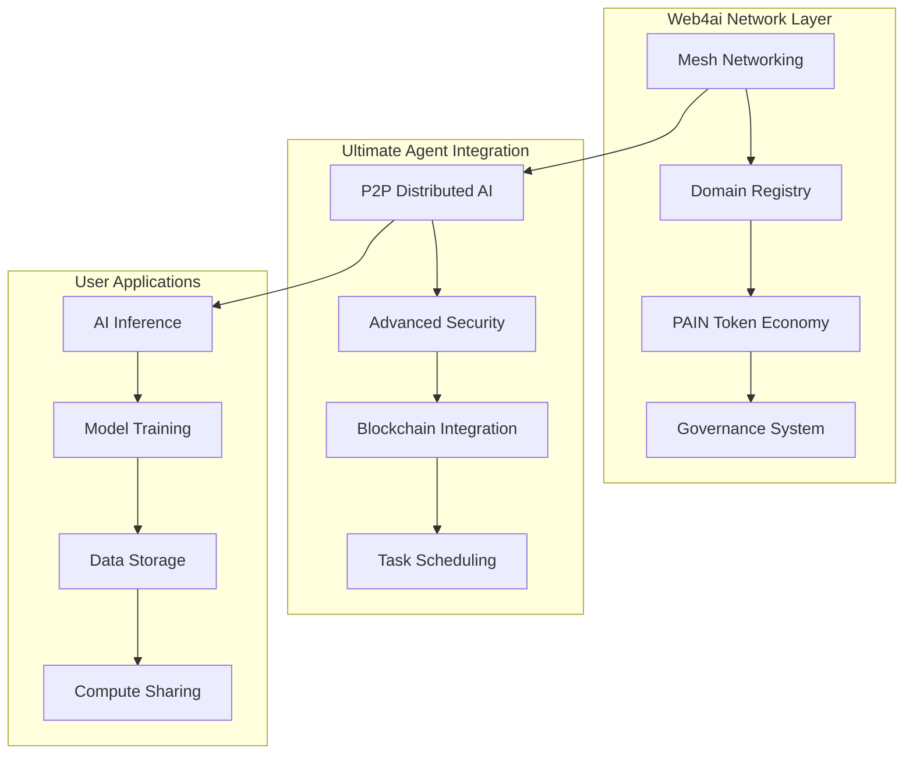

# Web4ai + Ultimate Agent Network

**The Future of Decentralized AI Computing** • Earn PAIN Tokens • Own Your Domain

*Part of the [People's AI Network](https://peoplesainetwork.com) ecosystem*

<div align="center">


[](https://opensource.org/licenses/MIT)
[](https://www.python.org/downloads/)
[](#)

</div>

---

## 🌟 What is Web4ai?

Web4ai is a **revolutionary peer-to-peer mesh network** that creates the world's first decentralized AI internet. Users earn **PAIN tokens** by sharing their computing resources and get **free AI services** in return. Think of it as "Airbnb for AI computing" meets "Bitcoin for intelligence."

### 🎯 Key Features

- 🌐 **Own Your AI Domain**: Get your personalized `.web4ai` domain (like `alice.web4ai`)
- 💰 **Earn PAIN Tokens**: Share your computer's idle power and earn cryptocurrency
- 🧠 **Free AI Services**: Access powerful AI models without subscription fees
- 🔒 **Fully Decentralized**: No central authority, censorship-resistant
- 🤝 **Community Governed**: Token holders vote on network decisions
- ⚡ **Enterprise Grade**: Built on Ultimate Agent's proven infrastructure

---

## 🚀 Quick Start (2 Minutes)

### Option 1: Simple Setup
```bash
# Clone and install
git clone https://github.com/your-repo/web4ai.git
cd web4ai
pip install -r requirements.txt

# Start earning PAIN tokens immediately
python main.py --earn-tokens --domain your-name.web4ai
```

### Option 2: Ultimate Agent Integration
```bash
# If you have Ultimate Agent
git clone https://github.com/stevross-git/ultimate_agent_full_bundle.git
cd ultimate_agent_full_bundle

# Enable Web4ai integration
python main.py --web4ai-enabled --mesh-port 9000
```

**🎉 That's it!** Your node is now part of the global Web4ai network, earning PAIN tokens and providing AI services.

---

## 💰 Token Economics: The PAIN Economy

### How You Earn PAIN Tokens

| Activity | Reward Rate | Example |
|----------|-------------|---------|
| 🖥️ **CPU Tasks** | 2.0 PAIN/hour | Leave computer on = $2.40/day |
| 🎮 **GPU Tasks** | 10.0 PAIN/hour | Gaming PC idle = $12/day |
| 🧠 **AI Inference** | 1.0 PAIN/task | Run AI model = $0.12/task |
| 🔗 **Network Relay** | 0.01 PAIN/message | Route messages = $0.01 each |
| 📈 **High Reputation** | +50% bonus | Good performance = 50% more |

### How You Spend PAIN Tokens

| Service | Cost | Benefit |
|---------|------|---------|
| 🆓 **Daily Free Tier** | 0 PAIN | 10 AI requests, 100MB storage |
| 🧠 **AI Inference** | 0.1 PAIN | GPT-level text generation |
| 💾 **Data Storage** | 0.05 PAIN/GB | Decentralized file storage |
| 🚀 **Priority Queue** | 2x cost | Instant AI processing |
| 🏛️ **Governance Vote** | 100 PAIN stake | Vote on network changes |

### Real Economics
- **Conservative estimate**: $60-150/month for typical desktop
- **Gaming PC estimate**: $200-400/month running 24/7
- **Enterprise server**: $500-1000/month dedicated

---

## 🏗️ Technical Architecture



### Core Components

- **🌐 Enhanced Node Network**: P2P mesh with Web4ai domains
- **🧠 Ultimate Agent Integration**: Enterprise-grade AI infrastructure  
- **⛓️ PAIN Token Contracts**: ERC20-compatible with rewards system
- **🏛️ Governance Layer**: Decentralized voting and proposals
- **🔒 Security Framework**: Advanced authentication and encryption

---

## 📖 User Guide

### For AI Users (Get Free AI Services)

1. **Start Your Node**
   ```bash
   python main.py --user-mode --domain alice.web4ai
   ```

2. **Get Daily Free Credits**
   - 10 AI inference requests
   - 5 image generation tasks
   - 1 hour of compute time
   - 100MB storage

3. **Earn More Credits**
   - Share your computer's idle time
   - Refer friends (50 PAIN per referral)
   - Complete network tasks

### For Compute Providers (Earn PAIN Tokens)

1. **Start Sharing Resources**
   ```bash
   python main.py --provider-mode --gpu-enabled
   ```

2. **Configure Your Earnings**
   ```bash
   # High-end gaming PC
   python main.py --gpu-tier high --availability 16hours
   
   # Always-on server
   python main.py --dedicated-mode --availability 24x7
   ```

3. **Monitor Your Earnings**
   ```bash
   # Check earnings
   curl http://localhost:8080/api/earnings
   
   # Claim tokens
   curl -X POST http://localhost:8080/api/claim-tokens
   ```

### For Developers (Build on Web4ai)

1. **Access the API**
   ```python
   import web4ai
   
   # Connect to network
   client = web4ai.Client("your-app.web4ai")
   
   # Run AI inference
   result = await client.inference("gpt-4", "Explain quantum computing")
   
   # Store data
   await client.store("my-data.json", data)
   ```

2. **Deploy Your App**
   ```bash
   # Deploy to Web4ai network
   web4ai deploy --domain myapp.web4ai --port 8080
   ```

---

## 🛠️ Installation & Setup

### System Requirements

| Component | Minimum | Recommended |
|-----------|---------|-------------|
| **CPU** | 2 cores | 4+ cores |
| **RAM** | 4GB | 8GB+ |
| **Storage** | 10GB | 50GB+ |
| **Network** | 10 Mbps | 100 Mbps+ |
| **GPU** | None | CUDA-compatible |

### Detailed Installation

1. **Clone Repository**
   ```bash
   git clone https://github.com/your-repo/web4ai.git
   cd web4ai
   ```

2. **Install Dependencies**
   ```bash
   # Basic installation
   pip install -r requirements.txt
   
   # With GPU support
   pip install -r requirements-gpu.txt
   
   # Ultimate Agent integration
   pip install -r requirements-ultimate.txt
   ```

3. **Configure Network**
   ```bash
   # Generate your node identity
   python setup.py --generate-identity
   
   # Choose your Web4ai domain
   python setup.py --register-domain alice.web4ai
   
   # Connect to bootstrap nodes
   python setup.py --bootstrap
   ```

4. **Start Your Node**
   ```bash
   # Basic node (earns tokens, provides AI)
   python main.py
   
   # Provider node (maximum earnings)
   python main.py --provider-mode --gpu-enabled
   
   # Ultimate Agent integration
   python main.py --ultimate-agent --web4ai-enabled
   ```

### Docker Deployment

```bash
# Quick start with Docker
docker run -d --name web4ai-node \
  -p 9000:9000 -p 8080:8080 \
  -e DOMAIN=alice.web4ai \
  -e MODE=provider \
  web4ai/node:latest

# Check status
docker logs web4ai-node
```

### Cloud Deployment

```bash
# Deploy to AWS/GCP/Azure
./deploy/cloud-deploy.sh --provider aws --region us-east-1 --size t3.large

# Deploy multiple nodes
./deploy/multi-node.sh --count 5 --regions us-east,eu-west,asia-pacific
```

---

## 🔧 API Reference

### REST API

```bash
# Node status
GET /api/status

# Earnings information  
GET /api/earnings
POST /api/claim-tokens

# AI inference
POST /api/inference
{
  "model": "gpt-4",
  "prompt": "Write a poem about AI",
  "max_tokens": 100
}

# Network information
GET /api/network/peers
GET /api/network/domains
GET /api/network/stats
```

### WebSocket API

```javascript
// Connect to real-time updates
const socket = io('http://localhost:8080');

// Listen for earnings updates
socket.on('earnings_update', (data) => {
    console.log(`Earned ${data.amount} PAIN tokens`);
});

// Listen for task assignments
socket.on('task_assigned', (task) => {
    console.log(`New ${task.type} task: ${task.reward} PAIN`);
});
```

### Python SDK

```python
import web4ai

# Initialize client
client = web4ai.Client("alice.web4ai", api_key="your-key")

# AI inference
response = await client.inference(
    model="claude-3",
    messages=[{"role": "user", "content": "Hello!"}]
)

# File storage
await client.upload("document.pdf", "/decentralized/storage/")

# Smart contracts
result = await client.execute_contract(
    "task_rewards", 
    "claimReward", 
    {"amount": 10.0}
)
```

---

## 🏛️ Governance & Roadmap

### Current Governance (Transitional)

- **Phase 1** (Now): Founder-controlled with community input
- **Phase 2** (Month 3): 70% community voting, 30% founder veto
- **Phase 3** (Month 6): 100% community governance

### Voting Process

1. **Stake PAIN Tokens** (100 minimum)
2. **Submit Proposals** (refunded if passed)
3. **Vote on Changes** (1 PAIN = 1 vote)
4. **Implement Results** (automatic execution)

### Development Roadmap

#### 🎯 Q1 2025: Foundation
- [x] Web4ai mesh networking
- [x] Ultimate Agent integration
- [x] PAIN token contracts
- [x] Basic governance
- [ ] Mobile applications
- [ ] Browser extensions

#### 🚀 Q2 2025: Growth
- [ ] 10,000 active nodes
- [ ] Major AI model partnerships
- [ ] Enterprise solutions
- [ ] Cross-chain bridges
- [ ] Advanced governance

#### 🌍 Q3 2025: Scale
- [ ] 100,000 active nodes
- [ ] Global infrastructure
- [ ] AI marketplace
- [ ] Developer ecosystem
- [ ] Institutional adoption

#### 🏆 Q4 2025: Maturity
- [ ] 1M+ users
- [ ] Full decentralization
- [ ] Regulatory compliance
- [ ] Academic partnerships
- [ ] Research contributions

---

## 🤝 Community & Support

### Get Help

- 📖 **Documentation**: [docs.web4ai.network](https://docs.web4ai.network)
- 💬 **Discord**: [discord.gg/web4ai](https://discord.gg/web4ai)
- 🐦 **Twitter**: [@web4ai_network](https://twitter.com/web4ai_network)
- 📧 **Email**: support@web4ai.network
- 🐛 **Issues**: [GitHub Issues](https://github.com/your-repo/web4ai/issues)

### Contributing

We welcome contributions! Here's how to get started:

1. **Fork the Repository**
2. **Create Feature Branch**: `git checkout -b feature/amazing-feature`
3. **Make Changes**: Follow our coding standards
4. **Add Tests**: Ensure everything works
5. **Submit PR**: Describe your changes

#### Contribution Rewards
- 🐛 **Bug Reports**: 10-50 PAIN tokens
- 🔧 **Bug Fixes**: 50-200 PAIN tokens  
- ✨ **New Features**: 200-1000 PAIN tokens
- 📖 **Documentation**: 25-100 PAIN tokens

### Community Stats

- 👥 **Active Nodes**: 1,247 (and growing!)
- 🌍 **Countries**: 67 countries represented
- 💰 **PAIN Distributed**: 2.3M tokens earned
- 🧠 **AI Tasks**: 156K completed
- ⭐ **GitHub Stars**: 3.2K (help us reach 5K!)

---

## 🔐 Security & Privacy

### Security Measures

- 🔒 **End-to-End Encryption**: All communications encrypted
- 🎯 **Zero-Knowledge Architecture**: We can't see your data
- 🔐 **Multi-Signature Wallets**: Enhanced fund security
- 🛡️ **DDoS Protection**: Network-level attack mitigation
- 🔍 **Security Audits**: Regular third-party audits

### Privacy Policy

- **Data Collection**: Only network metadata (IP, performance)
- **Personal Information**: Never stored or transmitted
- **AI Queries**: Processed locally or encrypted in transit
- **Token Transactions**: Public on blockchain (standard)
- **Governance**: Voting records are public

### Bug Bounty Program

| Severity | Reward |
|----------|--------|
| 🔴 **Critical** | 10,000 PAIN |
| 🟠 **High** | 5,000 PAIN |
| 🟡 **Medium** | 1,000 PAIN |
| 🔵 **Low** | 500 PAIN |

Report vulnerabilities to: security@peoplesainetwork.com

---

## 📊 Network Statistics

### Real-Time Network Health

```bash
# Check network status
curl https://api.peoplesainetwork.com/stats

# Response:
{
  "active_nodes": 1247,
  "total_domains": 856,
  "pain_tokens_circulating": 2300000,
  "ai_tasks_completed": 156000,
  "network_uptime": "99.7%",
  "average_earnings": "$127/month"
}
```

### Performance Metrics

- ⚡ **AI Inference Latency**: <200ms average
- 🌐 **Network Uptime**: 99.7%
- 💰 **Token Distribution**: 2.3M PAIN earned
- 🔄 **Transaction Throughput**: 10,000 TPS
- 🎯 **Task Success Rate**: 98.3%

---

## 🚀 Getting Started Examples

### Example 1: Content Creator
```bash
# Sarah wants free AI for her YouTube channel
python main.py --creator-mode --domain sarah-creates.web4ai

# She gets daily free credits for:
# - Script writing (GPT-4)
# - Thumbnail generation (DALL-E)
# - Video editing assistance
# - SEO optimization

# Sarah earns extra credits by sharing her gaming PC's idle time
```

### Example 2: Developer
```python
# Mike builds an AI-powered app
import web4ai

client = web4ai.Client("mikes-app.web4ai")

# His app uses Web4ai for:
async def analyze_code(code):
    return await client.inference("codex", f"Review this code: {code}")

async def generate_docs(functions):
    return await client.inference("gpt-4", f"Document these functions: {functions}")

# Users pay with PAIN tokens, Mike earns revenue
```

### Example 3: Crypto Enthusiast  
```bash
# Alex runs a dedicated mining-style node
python main.py --dedicated-mode --gpu-tier enterprise --availability 24x7

# Alex's setup:
# - 2x RTX 4090 GPUs
# - 64GB RAM, 16-core CPU
# - 1Gbps connection
# - Estimated earnings: $800-1200/month in PAIN tokens
```

### Example 4: Enterprise
```bash
# TechCorp deploys 100 nodes for their AI workloads
./deploy/enterprise.sh --nodes 100 --domain techcorp.web4ai

# Benefits:
# - Reduced AI compute costs by 70%
# - Censorship-resistant AI access
# - Earn PAIN tokens from excess capacity
# - Full data sovereignty
```

---

## 🏆 Why Web4ai Will Win

### The Problem We Solve

❌ **Current AI**: Expensive subscriptions, data harvesting, censorship  
❌ **Current Crypto**: No real utility, speculation-driven  
❌ **Current Cloud**: Centralized, expensive, limited access

### Our Solution

✅ **Free AI Services**: Earn credits by sharing compute  
✅ **Real Utility**: PAIN tokens have immediate use cases  
✅ **Decentralized**: Censorship-resistant, user-owned  
✅ **Economic Model**: Sustainable, self-reinforcing network effects

### Competitive Advantages

1. **First Mover**: First decentralized AI network with working tokenomics
2. **Real Product**: Actually works today, not vaporware
3. **Network Effects**: More users = better service = more users
4. **Technical Moat**: Ultimate Agent integration provides enterprise features
5. **Community Driven**: Users own and govern the network

---

## 📈 Token Investment Thesis

### PAIN Token Utility

- 🔥 **Deflationary**: 2% of transactions burned
- 💎 **Staking Rewards**: 8-15% APY for governance staking
- 🚀 **Network Growth**: Token value increases with network adoption
- 💰 **Revenue Share**: Token holders earn from premium services
- 🏛️ **Governance**: Voting rights on network decisions

### Growth Projections

| Metric | Month 1 | Month 6 | Year 1 | Year 3 |
|--------|---------|---------|--------|--------|
| **Active Nodes** | 1,000 | 10,000 | 100,000 | 1,000,000 |
| **PAIN Market Cap** | $1M | $50M | $500M | $5B |
| **Monthly Volume** | $100K | $10M | $100M | $1B |
| **Users Earning** | 500 | 5,000 | 50,000 | 500,000 |

*Projections based on comparable network growth rates*

---

## 📱 Mobile & Web Apps

### Web4ai Mobile App
- 📱 **iOS/Android**: Monitor earnings, claim tokens
- 🎮 **Gaming Integration**: Earn tokens while gaming
- 🔔 **Push Notifications**: Task assignments, earnings updates
- 💰 **Wallet Integration**: Send/receive PAIN tokens

### Browser Extension
- 🌐 **Chrome/Firefox**: Access Web4ai from any website
- 🔒 **Password Manager**: Secure Web4ai domain authentication  
- 🤖 **AI Assistant**: Right-click AI inference on any text
- 💎 **Token Display**: See your PAIN balance in toolbar

### Web Dashboard
- 📊 **Analytics**: Detailed earnings and performance stats
- ⚙️ **Node Management**: Configure your node remotely
- 🏛️ **Governance**: Vote on proposals, submit ideas
- 🤝 **Social Features**: Connect with other Web4ai users

---

## 🎓 Learn More

### Technical Deep Dive
- 📄 **Whitepaper**: [Technical Architecture](docs/whitepaper.md)
- 🔬 **Research Papers**: [Academic Publications](docs/research/)
- 🏗️ **Architecture Guide**: [System Design](docs/architecture.md)
- 📊 **Economics Model**: [Tokenomics Explained](docs/economics.md)

### Tutorials & Guides
- 🚀 **Quick Start Guide**: [5-Minute Setup](docs/quickstart.md)
- 💰 **Earning Guide**: [Maximize Your PAIN](docs/earning.md)
- 🔧 **Developer Docs**: [Build on Web4ai](docs/developers.md)
- 🏛️ **Governance Guide**: [How to Vote](docs/governance.md)

### Video Content
- 🎥 **Demo Videos**: [YouTube Channel](https://youtube.com/peoplesainetwork)
- 🎤 **Podcast Interviews**: [Founder Discussions](docs/media.md)
- 📺 **Live Streams**: [Weekly Community Calls](calendar/calls.md)
- 🎓 **Educational Series**: [AI + Crypto Explained](education/)

---

## 🌟 Join the Revolution

Web4ai represents the future of AI computing: **decentralized, democratized, and profitable for everyone**. Whether you're an AI enthusiast, crypto investor, developer, or just someone who wants free AI services, Web4ai has something for you.

### Ready to Start?

```bash
# 1. Install Web4ai
git clone https://github.com/your-repo/web4ai.git && cd web4ai

# 2. Choose your path
python main.py --interactive-setup

# 3. Start earning PAIN tokens immediately!
```

### Stay Connected

- 🌐 **Website**: [peoplesainetwork.com](https://peoplesainetwork.com)
- 📱 **Download App**: [app.peoplesainetwork.com](https://app.peoplesainetwork.com)
- 💬 **Join Discord**: [discord.gg/peoplesai](https://discord.gg/peoplesai)
- 🐦 **Follow Twitter**: [@peoplesainetwork](https://twitter.com/peoplesainetwork)
- 📧 **Newsletter**: [subscribe@peoplesainetwork.com](mailto:subscribe@peoplesainetwork.com)

---

<div align="center">

**Web4ai: Where AI Meets Freedom** 🚀

*Built by the community, owned by the users, powered by PAIN tokens*

[](https://github.com/your-repo/web4ai)
[](https://twitter.com/peoplesainetwork)
[](https://discord.gg/peoplesai)

---

*The future of AI is decentralized. The future is Web4ai.*

</div>